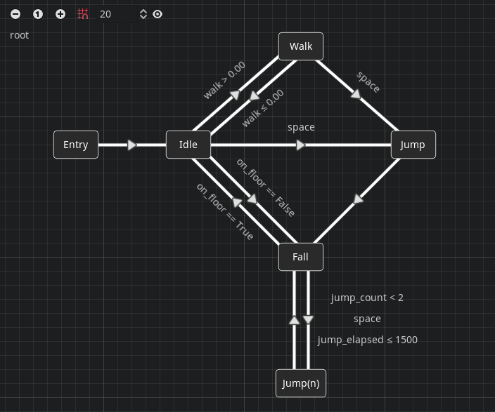
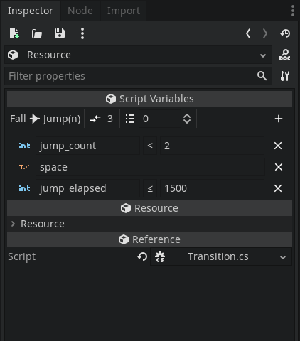
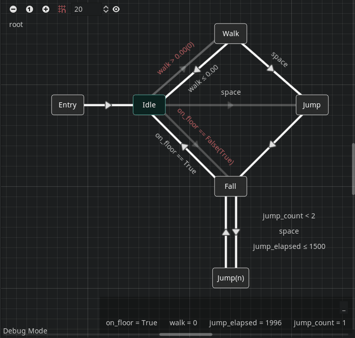

# Fractural FSM 🍥

Fratural FSM is a Godot 3.x C# addon that adds finite state machines into Godot.

This is a modified C# port of imjp94's [gd-YAFSM](https://github.com/imjp94/gd-YAFSM).

# Features

- Designer-friendly UI

  

  

  > State machine is laid out as a graph with labelled connections

- Remote debugger

  

  > The state machine can be visualized at runtime

- Nested FSM

  > You can have nested state machines

- Reusability

  > State machines can be saved as a `StateMachine` Resource and stored in the file system.

## Installation

1. Download addons/FracturalFSM
2. Download addons/FracturalCommons
3. Move them into the addons folder of your project
4. Install the FracturalGodotCodeGenerator package on nuget
5. Change your Visual Studio solution to use language version 8.0
6. Build the C# solution
7. Enable FracturalCommons and FracturalFSM in your addons

## TODO

- Add loading of states from a C# script to encapsulate behavior
- Add support for [GodotRollbackMono](https://github.com/Fractural/GodotRollbackNetcodeMono)